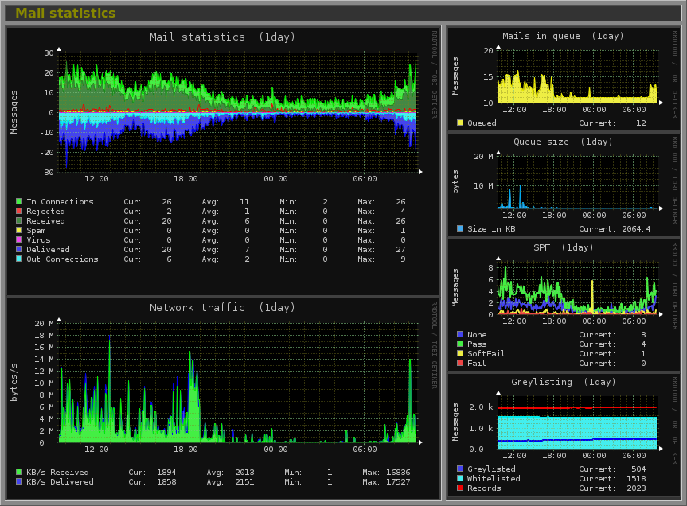

<!--
Nota bene : ce README est automatiquement généré par <https://github.com/YunoHost/apps/tree/master/tools/readme_generator>
Il NE doit PAS être modifié à la main.
-->

# Monitorix pour YunoHost

[](https://ci-apps.yunohost.org/ci/apps/monitorix/)  

[](https://install-app.yunohost.org/?app=monitorix)

*[Lire le README dans d'autres langues.](./ALL_README.md)*

> *Ce package vous permet d’installer Monitorix rapidement et simplement sur un serveur YunoHost.*  
> *Si vous n’avez pas YunoHost, consultez [ce guide](https://yunohost.org/install) pour savoir comment l’installer et en profiter.*

## Vue d’ensemble

Monitorix is a free, open source, lightweight system monitoring tool designed to monitor as many services and system resources as possible.

It has been created to be used under production Linux/UNIX servers, but due to its simplicity and small size can be used on embedded devices as well.


**Version incluse :** 3.15.0~ynh10

**Démo :** <https://www.fibranet.cat/monitorix/>

## Captures d’écran



## Documentations et ressources

- Site officiel de l’app : <https://monitorix.org>
- Documentation officielle de l’admin : <https://www.monitorix.org/documentation.html>
- Dépôt de code officiel de l’app : <https://github.com/mikaku/Monitorix>
- YunoHost Store : <https://apps.yunohost.org/app/monitorix>
- Signaler un bug : <https://github.com/YunoHost-Apps/monitorix_ynh/issues>

## Informations pour les développeurs

Merci de faire vos pull request sur la [branche `testing`](https://github.com/YunoHost-Apps/monitorix_ynh/tree/testing).

Pour essayer la branche `testing`, procédez comme suit :

```bash
sudo yunohost app install https://github.com/YunoHost-Apps/monitorix_ynh/tree/testing --debug
ou
sudo yunohost app upgrade monitorix -u https://github.com/YunoHost-Apps/monitorix_ynh/tree/testing --debug
```

**Plus d’infos sur le packaging d’applications :** <https://yunohost.org/packaging_apps>
