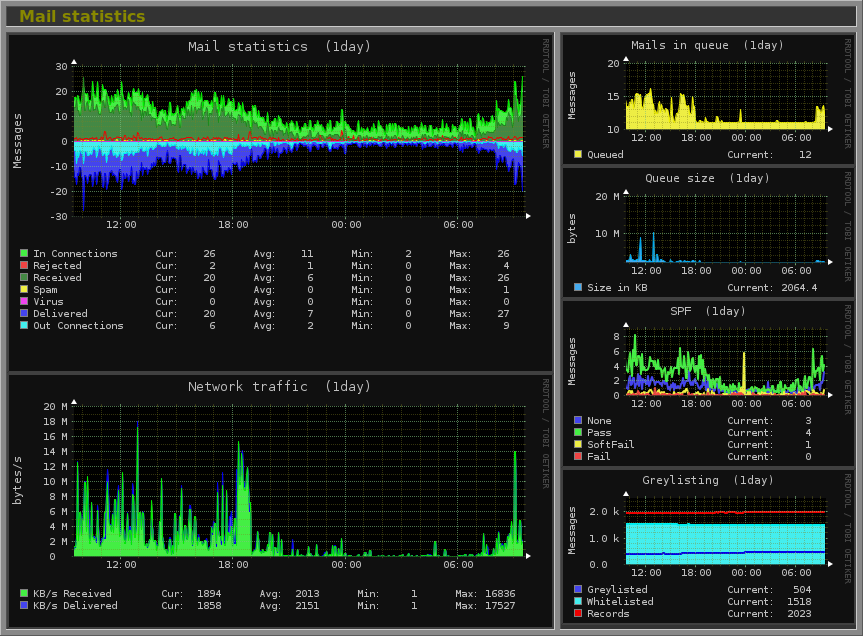

<!--
To README zostało automatycznie wygenerowane przez <https://github.com/YunoHost/apps/tree/master/tools/readme_generator>
Nie powinno być ono edytowane ręcznie.
-->

# Monitorix dla YunoHost

[](https://ci-apps.yunohost.org/ci/apps/monitorix/)


[](https://install-app.yunohost.org/?app=monitorix)

*[Przeczytaj plik README w innym języku.](./ALL_README.md)*

> *Ta aplikacja pozwala na szybką i prostą instalację Monitorix na serwerze YunoHost.*  
> *Jeżeli nie masz YunoHost zapoznaj się z [poradnikiem](https://yunohost.org/install) instalacji.*

## Przegląd

Monitorix is a free, open source, lightweight system monitoring tool designed to monitor as many services and system resources as possible.

It has been created to be used under production Linux/UNIX servers, but due to its simplicity and small size can be used on embedded devices as well.


**Dostarczona wersja:** 3.15.0~ynh8

**Demo:** <https://www.fibranet.cat/monitorix/>

## Zrzuty ekranu



## Dokumentacja i zasoby

- Oficjalna strona aplikacji: <https://monitorix.org>
- Oficjalna dokumentacja dla administratora: <https://www.monitorix.org/documentation.html>
- Repozytorium z kodem źródłowym: <https://github.com/mikaku/Monitorix>
- Sklep YunoHost: <https://apps.yunohost.org/app/monitorix>
- Zgłaszanie błędów: <https://github.com/YunoHost-Apps/monitorix_ynh/issues>

## Informacje od twórców

Wyślij swój pull request do [gałęzi `testing`](https://github.com/YunoHost-Apps/monitorix_ynh/tree/testing).

Aby wypróbować gałąź `testing` postępuj zgodnie z instrukcjami:

```bash
sudo yunohost app install https://github.com/YunoHost-Apps/monitorix_ynh/tree/testing --debug
lub
sudo yunohost app upgrade monitorix -u https://github.com/YunoHost-Apps/monitorix_ynh/tree/testing --debug
```

**Więcej informacji o tworzeniu paczek aplikacji:** <https://yunohost.org/packaging_apps>
